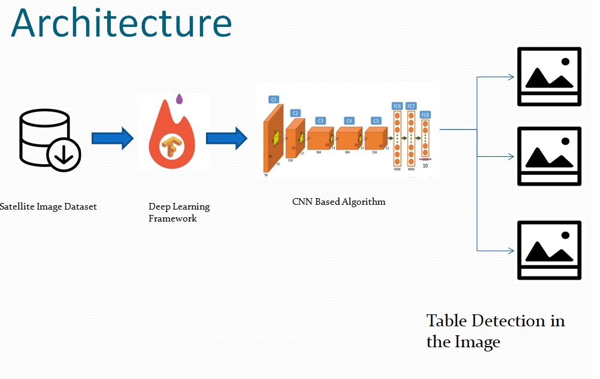

# Deep Learning based Table Detection (LUMINOTH)
Deep Learning based Table Detection (LUMINOTH)

This project focuses on "Signature Verification" by [Keras and ObjectTensorFlow Detection API](https://github.com/tensorflow/models/tree/master/research/object_detection). 

The system shall work in 2 steps:

Step 1: Accept document input, read tables: System should have an input mechanism for accepting documents images (TIFF, JPEG). The document may have one or more tables.


Step 2: Step 2: As an output, system should return the table content in an excel format,same as that in the sample data sets

# More Details can be found in PPT

## Dataset used   UNLV dataset


## Quick Demo

https://youtu.be/cwIQlJRHuA4


***THE DEVELOPING IS ON PROGRESS! THE REPO WILL BE UPDATED SOON, !***


--------------


## Architecture

<p align="center">
  

</p>


-------------------------------------------------------------------------------------------

## Result 1

<p align="center">
  
">
</p>

-------------------------------------------------------------------------------------------

## Result 2
<p align="center">
  
">
</p>

-------------------------------------------------------------------------------------------

# Installation

Luminoth currently supports Python 2.7 and 3.4–3.6.

## Pre-requisites

To use Luminoth, [TensorFlow](https://www.tensorflow.org/install/) must be installed beforehand. If you want **GPU support**, you should install the GPU version of TensorFlow with `pip install tensorflow-gpu`, or else you can use the CPU version using `pip install tensorflow`.

## Installing Luminoth

Just install from PyPI:

```bash
pip install luminoth
```

Optionally, Luminoth can also install TensorFlow for you if you install it with `pip install luminoth[tf]` or `pip install luminoth[tf-gpu]`, depending on the version of TensorFlow you wish to use.

### Google Cloud

If you wish to train using **Google Cloud ML Engine**, the optional dependencies must be installed:

```bash
pip install luminoth[gcloud]
```

## Installing from source

First, clone the repo on your machine and then install with `pip`:

```bash
git clone https://github.com/tryolabs/luminoth.git
cd luminoth
pip install -e .
```


# Run "run.py"


## License
This system is available under the MIT license. See the LICENSE file for more info.
